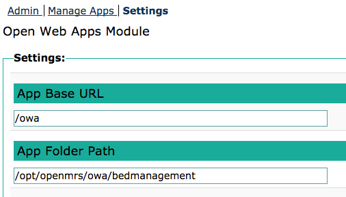

# Bed Management OWA
> An front-end React app for the _admin_ side of bed management:
management of admisson locations, addition & removal of beds, setup of bed layouts, ... etc.

## Installation / Production Use
The Bed Management UI OWA will be automatically deployed upon installing the Bed Management module.

## Developer Guide
> This OWA uses [yarn](https://yarnpkg.com/en/) as a package manager and for its build tasks.
#### Local dev setup

##### 1. After cloning the project, move into the /owa directory:
```bash
cd openmrs-module-bedmanagement/owa
```

##### 2. Install the yarn dependencies:
```bash
$ yarn install
```

##### 3. Compile the code and build the artifacts for 'watching':
```bash
$ yarn webpack
```
The output of the build should be in
- **owa/app/build/app.js**
- **owa/app/build/vendor.js**

This command also triggers the watch mode for debugging. This means that any changes will trigger an update to the main **app.js** in order to hot-deploy changes while developing.

##### 4. Deployment for runtime debugging:

Start by accessing the OWA settings admin page at **/openmrs/module/owa/settings.form** on your runtime instance of OpenMRS. 
> Note that the Open Web Apps module must be installed, see [here](https://wiki.openmrs.org/x/C4KIBQ) for more information.

The key setting is the 'App Folder Path' that must point to the _enclosing_ folder of the OWA **app** folder, so the enclosing folder of the location of where **manifest.webapp** is.
Typically the location for all OWAs of your OpenMRS instance should be in **/opt/openmrs/owa**, the idea would be to symlink the content of the Bed Management OWA to your code repo:
```bash
ln -s /path/to/../openmrs-module-bedmanagement/owa/app /opt/openmrs/owa/bedmanagement
```
This is assuming that Tomcat is able to serve symlinked content. If that is not an option, then you will have to _copy_ (instead of symlinking) the content of the **app** folder of your local repository to **/opt/openmrs/owa/bedmanagement** each time you want to observe a change that you have made.



##### 5. Running tests
>This OWA uses [Jest](https://facebook.github.io/jest/) as a test framework.

```bash
$ yarn test
$ yarn test-watch  # if you want run test in watch mode
```
If you want to run specific test only
```bash
$ yarn test <regex>
```
Where 'regex' can be used to point to certain targetted test files.

>This OWA uses [snapshot testing](http://facebook.github.io/jest/docs/en/snapshot-testing.html#snapshot-testing-with-jest).

When it is clear that UI changes are as wanted, the Jest snapshots should be regenerated to be part of the next commit:
```bash
$ yarn test --u
```